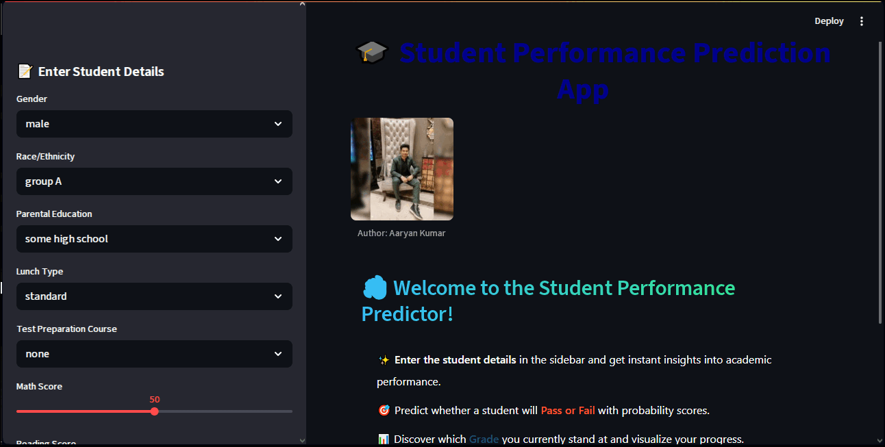

<p align="center">
  
</p>

<h1 align="center">🎓 Student Performance Predictor 🎓</h1>

<p align="center">
  
  
  
  
  
  
  
</p>

---

## 📑 Table of Contents  

<p align="center">
  <a href="#-profile-stats">
    
  </a>  
  <br/>
  <a href="#-project-overview">
    
  </a>  
  <br/>
  <a href="#-file-structure">
    
  </a>  
  <br/>
  <a href="#-how-to-run-the-project">
    
  </a>  
  <br/>
  <a href="#-features">
    
  </a>  
  <br/>
  <a href="#-project-showcase">
    
  </a>  
  <br/>
  <a href="#-tech-stack">
    
  </a>  
  <br/>
  <a href="#-internship-details">
    
  </a>  
  <br/>
  <a href="#-author">
    
  </a>  
</p>

---

## 📊 Profile Stats

<p align="center">
  <a href="https://github.com/aaryan498">
    
  </a>
  <a href="https://github.com/aaryan498?tab=followers">
    
  </a>
  <a href="https://github.com/aaryan498">
    
  </a>
</p>

<p align="center">
  
  
</p>

---

✨ *An ML-powered app to predict student performance based on input data, deployed with Streamlit for interactive use.*


---

# 📖 Project Overview  

This project is a **Student Performance Analysis System** designed to evaluate and predict student outcomes.  

✨ **What it does:**  
- 📊 Predicts a student’s **academic performance**.  
- 📝 Takes into account **test scores, parental background, and study habits**.  
- 🎯 Provides **grades and performance insights** in a user-friendly way.  
- 💡 Helps identify whether a student is likely to be a **top performer or needs improvement**.  

🔑 **Key Highlights:**  
- Built using **Python, Scikit-learn, Pandas, Matplotlib, Seaborn, and Streamlit**.  
- Implements **data preprocessing, exploratory data analysis (EDA), and machine learning modeling**.  
- Provides a **Streamlit web interface** where users can enter student details and get predictions instantly.  
- Displays **summary tables, grade classification, and insights** in a clear and visually appealing way.  
- Stores multiple student records during runtime for tracking and comparison.  

---

## 📂 File Structure
```
ML_Project_SPA/
├── predict.py                        # Data cleaning, EDA, model training & CLI
├── app.py                            # Streamlit web app (interactive UI)
├── README.md                         # Project documentation (this file)
├── requirements.txt                  # Required dependencies
├── student_performance_model.pkl     # Saved model + feature_columns (joblib artifact)
└── StudentsPerformance.csv           # Original dataset (Kaggle)
```

---

## 🚀 How to Run the Project

Follow these steps to set up and run the **Student Performance Analysis System** on your local machine.

### 1️⃣ Clone the Repository
```bash
git clone https://github.com/aaryan498/ML_Project_SPA.git
```
### 2️⃣ Create a Virtual Environment (Recommended)

```bash
# Create virtual environment
python -m venv venv

# Activate it
# On Windows
venv\Scripts\activate
# On Mac/Linux
source venv/bin/activate
```
### 3️⃣ Install Dependencies

```bash
pip install -r requirements.txt
```
### 4️⃣ Run Data Preprocessing & Model Training  

This step will clean the dataset, perform EDA, and train the model.  
It will also generate the **student_performance_model.pkl** file (if not already present).  

```bash
python predict.py
```
### 5️⃣ Launch the Streamlit Web App  

Run the app to get an interactive interface for student performance prediction.  

```bash
streamlit run app.py
```
### 6️⃣ Access the App  

Once Streamlit starts, it will show a local URL such as:  

```bash
# This is just an example not the actual link.
Local URL: http://localhost:8501
```
👉 Open this link in your browser to use the app.

### 7️⃣ Exit  

When you’re done, press `CTRL + C` in the terminal to stop the server.  
Deactivate the virtual environment:  

```bash
deactivate
```
⚡ That’s it! Your Student Performance Predictor is now up and running 🎉

---

## 🎯 Features  

✨ **Core Functionality**  
- ✅ Predicts student performance as **Pass / Fail** with probability scores.  
- ✅ Assigns **letter grades (A–F)** based on average scores.  
- ✅ Saves and displays a **summary of all students entered** in the session.  

📊 **Insights & Visualization**  
- 📈 Displays **performance probabilities** with progress bars.  
- 🃏 Attractive **grade cards** with dynamic color coding (A=Green, B=Blue, …, F=Red).  
- 📊 Interactive **summary tables** with conditional styling (green for Pass, red for Fail).  
- 🍰 Built-in **visual insights**:    

---

## 📸 Project Showcase  

<p align="center">
  
</p>

---

<p align="center">
  <!-- Fancy GIF Carousel effect -->
  
</p>

---

### 🔗 Live Demo  
[](https://your-demo-link.com)

---

## 📊 Tech Stack  

### 🖥️ Programming Language  
  

### 📚 Libraries & Frameworks  
**Data Handling & Analysis**  
   

**Machine Learning**  
   

**Exploratory Data Analysis & Visualization**  
    

**Web App Deployment**  
  
  

---

## 🏅 Internship Details  

This project was developed as part of my **College Internship Project** at:  

🎓 **Ajay Kumar Garg Engineering College, Ghaziabad, Uttar Pradesh**  

### 📌 Internship Highlights  
- 📅 **Duration:** 10 Days  
- 💻 **Domain:** Python Programming & Machine Learning  
- 📝 **Research Work:** Writing a research paper on this project is also an integral part of the internship  

---

## 👨‍💻 Author  

<p align="center">
  
</p>

<p align="center">
  
</p>

<p align="center">
  
</p>

<p align="center">
  <a href="https://github.com/aaryan498">
    
  </a>
  <a href="https://www.linkedin.com/in/aaryan-kumar-ai-498-coder/">
    
  </a>
  <a href="mailto:aaryankumarofficial498@gmail.com">
    
  </a>
</p>

<p align="center">
  ⭐ If you like this project, don't forget to star the repo! ⭐
</p>


